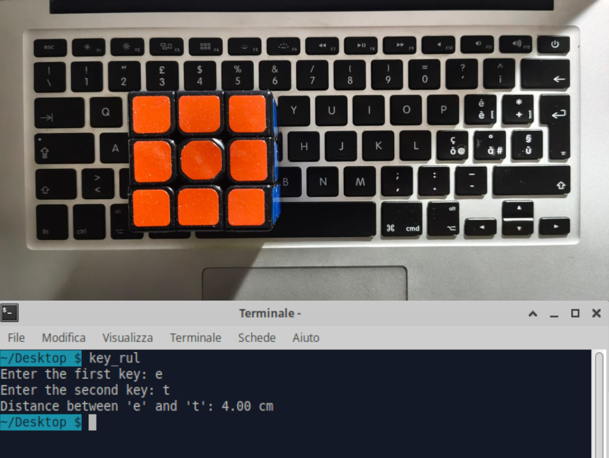

# Keyboard ruler

The Keyboard Ruler is a satirical project intended as a direct provocation toward the tools we use every day without truly understanding their full functionality. Computer and laptop keyboards, in addition to having a practical functional dimension, also possess a spatial one, rarely considered or utilized. In an era where the fluidity of digital technology has made us forget the craftsmanship involved in using communication tools, projects like this can awaken users’ awareness.

### Usage

- Place an object on the keyboard, aligning it between two keys you want to measure.
- Run the program from a terminal.
- When prompted, press the first key the object touches.
- Press the second key at the other end of the object.
- The program will output the distance in centimeters between the two keys.

### Image sample




### Setup

First line of the program contains dimension of keycaps and distance between them. Every test was performed on a qwerty keyboard for MacBook Air 2013. In order to calibrate the ruler make sure to change parameters:  _KEY_WIDTH_CM_, _KEY_SPACING_CM_.


``` c
#include <stdio.h>
#include <string.h>
#include <ctype.h>
#include <math.h>

// Key dimensions in centimeters
#define KEY_WIDTH_CM 1.8
#define KEY_SPACING_CM 0.2

```
### Installation

Terminal command used to build the executable and install the ruler.

```
make          # compile
make run      # execute
make install  # installation in ~/.local/bin/
make clean    # delete executable file

```
